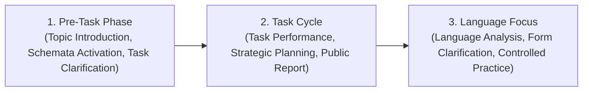

# 🌍 ESL Lesson Flow Master Guide: Task-Based Language Teaching (TBLT)

## 📌 Conceptual Framework & Methodological Rationale

**Task-Based Language Teaching (TBLT)** centers the learning process around the completion of authentic, communicative tasks rather than the pre-programmed presentation of isolated grammatical structures. Unlike the classical **PPP (Presentation, Practice, Production)** model, TBLT treats language as a communicative tool where meaning is primary, and grammatical form is addressed reflexively during and after task execution.



---

## 🏛️ The Three-Stage TBLT Architecture (Willis Model)

### 1. The Pre-Task Phase (10–15% of Lesson Time)
- **Primary Objective**: Activate background knowledge, introduce topic vocabulary, establish communicative stakes, and model task expectations.
- **Teacher Actions**:
  - Introduce the theme with a high-impact stimulus (video clip, authentic document, problem scenario).
  - Highlight useful lexical chunks without giving a formal grammar lecture.
  - Present a brief model of the task (e.g., audio recording of native speakers performing the task or teacher live demonstration).
  - Ensure all learners understand the exact deliverable (e.g., *a ranked list, an itinerary, a crisis action plan, a peer recommendation*).

---

### 2. The Task Cycle (60–70% of Lesson Time)

The Task Cycle consists of three interdependent stages:

```
┌─────────────────────────────────────────────────────────────┐
│                       THE TASK CYCLE                        │
├─────────────────┬─────────────────────┬─────────────────────┤
│   A. The Task   │     B. Planning     │      C. Report      │
│  (Small Groups) │   (Draft & Rehearse)│   (Public Sharing)  │
│                 │                     │                     │
│ Learners engage │ Learners prepare to │ Groups present their│
│ in spontaneous, │ present their       │ findings or spoken  │
│ fluency-driven  │ outcome to the rest │ conclusions to the  │
│ communication.  │ of the class with   │ whole class;        │
│ Teacher monitors│ teacher language    │ teacher records key │
│ discreetly.     │ support.            │ language patterns.  │
└─────────────────┴─────────────────────┴─────────────────────┘
```

#### Stage A: Task Performance (Pairs / Small Groups)
- Learners work in pairs or groups of 3–4 to complete the communicative assignment.
- Focus is 100% on communication, negotiation of meaning, and task accomplishment.
- Teacher monitors from a distance, noting communicative strategies and language breakdowns without interrupting flow.

#### Stage B: Planning Stage
- Learners prepare a brief spoken or written report summarizing their decisions or solutions to present to the entire class.
- Language focus naturally sharpens here as learners want to sound articulate and accurate before their peers.
- Teacher acts as a language consultant, answering questions on vocabulary, collocations, and grammatical clarity.

#### Stage C: The Report Stage
- Groups present their findings or exchange written summaries.
- The class compares outcomes (e.g., *Which group selected the best marketing strategy? Whose travel itinerary is most cost-effective?*).

---

### 3. The Language Focus Phase (15–20% of Lesson Time)
- **Primary Objective**: Direct attention explicitly to linguistic forms, grammatical accuracy, and lexical upgrades observed during the task cycle.
- **Two Integral Components**:
  1. **Analysis**:
     - Teacher pulls specific phrases and syntax from student interactions or transcripts of the task recording.
     - Class analyzes syntactic patterns, collocations, and prepositions.
     - Anonymized error correction from the teacher's monitoring notes.
  2. **Practice**:
     - Quick, focused controlled practice drills (sentence transformations, collocation gap-fills) to cement accurate usage.

---

## 📋 Comparative Methodological Matrix: PPP vs. TBLT vs. TTT

| Dimension | PPP (Presentation - Practice - Production) | TBLT (Task-Based Language Teaching) | TTT (Test - Teach - Test) |
| :--- | :--- | :--- | :--- |
| **Starting Point** | Teacher presents target grammar structure. | Meaningful real-world communicative problem. | Diagnostic accuracy test or communicative drill. |
| **Language Target** | Predetermined and singular (e.g. *Past Continuous*). | Emergent, varied, and holistic (lexis + grammar). | Targeted to fix specific diagnostic errors. |
| **Learner Role** | Imitator $\rightarrow$ Controlled user $\rightarrow$ Producer. | Active problem solver and collaborator. | Test taker $\rightarrow$ Receptive student $\rightarrow$ Tester. |
| **Error Feedback** | Immediate during practice; delayed in production. | Delayed to the Language Focus stage. | Immediate after diagnostic and final test. |
| **Best Suited For** | A1–B1 structural foundations and discrete points. | B1–C2 communicative fluency and task mastery. | B1–C1 remedial brush-ups and exam prep. |

---

## 🛠️ Ready-to-Use TBLT Classroom Execution Blueprint

### Example Task: "The Eco-Tourism Development Pitch" (Level B2/C1)

#### 1. Pre-Task (10 mins)
- Teacher shows 3 photos of an untouched tropical island facing environmental challenges.
- Elicits key vocabulary: *carrying capacity, indigenous rights, revenue generation, carbon footprint, ecological conservation*.
- Sets the deliverable: *"Each group has \$2,000,000 to design a sustainable eco-lodge and present a 3-minute pitch to the Island Council."*

#### 2. Task Cycle (35 mins)
- **Task (15 mins)**: Groups review 4 bidding proposals with competing priorities (luxury cabins vs. research facility vs. adventure camping). They negotiate budget allocation.
- **Planning (10 mins)**: Groups outline their 3-minute pitch, drafting formal phrases (*"Our primary allocation focuses on...", "We have prioritized..."*).
- **Report (10 mins)**: Group spokespersons pitch. The class votes on the winning proposal based on sustainability and financial viability.

#### 3. Language Focus (15 mins)
- **Board Analysis**: Examine phrases used during pitches:
  - *❌ "We decided to spend money for make solar panels."* ➔ **Upgrade**: *"We allocated funds **toward installing** solar arrays."*
  - *❌ "The project will bring many profits."* ➔ **Upgrade**: *"The initiative is projected to **generate substantial revenue**."*
- **Practice**: 5 rapid collocation transformation items matching verbs (*allocate, prioritize, offset, implement*) with target nouns.

---

## 📊 TBLT Pedagogical Quality Checklist for Instructors

- [ ] **Authenticity**: Is the task something people do in real life outside the classroom?
- [ ] **Non-Linguistic Outcome**: Does the task have a tangible goal beyond simply "practicing English"?
- [ ] **Meaning Priority**: Were students allowed to solve the task using their own linguistic repertoire?
- [ ] **Collaborative Negotiation**: Did students have to negotiate meaning and make collaborative decisions?
- [ ] **Dedicated Form Focus**: Did the lesson conclude with an explicit, rigorous language analysis stage based on observed output?
