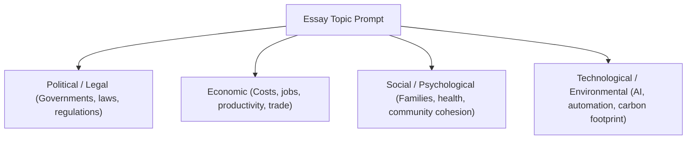

# 🎯 IELTS Academic Writing Task 2: Band 9 Cohesion & Idea Generation Master Guide

## 📌 Executive Overview
**Writing Task 2 contributes 66% (two-thirds) of your total IELTS Writing score**. To score **Band 8.0–9.0**, you must demonstrate fully developed ideas, clear progression, sophisticated paragraphing (PEEL method), and seamless cohesive devices that avoid mechanical linking.

---

## 🏛️ The 5 IELTS Task 2 Essay Types & Structural Blueprints

```
┌─────────────────────────────────────────────────────────────┐
│                 THE 5 TASK 2 ESSAY BLUEPRINTS               │
├───────────────────────────────┬─────────────────────────────┤
│ 1. Opinion (Agree / Disagree) │ 4. Advantages vs. Disadvantages│
│ 2. Discuss Both Views + Opinion│ 5. Double / Direct Question │
│ 3. Problem & Solution / Causes │                             │
└───────────────────────────────┴─────────────────────────────┘
```

### 1. Opinion (Agree / Disagree)
- **Intro**: Paraphrase prompt + Explicit Thesis Statement taking a clear stance.
- **Body 1**: First major argument supporting your stance (PEEL framework).
- **Body 2**: Second major argument supporting your stance (or concession + rebuttal).
- **Conclusion**: Restate thesis in fresh words + final synthesis.

### 2. Discuss Both Views and Give Your Opinion
- **Intro**: Paraphrase both perspectives + Thesis declaring your personal allegiance.
- **Body 1**: Fully explore View A (why proponents hold this perspective).
- **Body 2**: Fully explore View B (why you or proponents hold this view).
- **Conclusion**: Summarize both views + reaffirm why your perspective is superior.

### 3. Problem and Solution / Causes and Effects
- **Intro**: Paraphrase phenomenon + Thesis stating key causes and solutions exist.
- **Body 1**: 2 specific primary causes/problems with real-world explanations.
- **Body 2**: 2 actionable, concrete governmental or technological solutions.
- **Conclusion**: Summarize causes + highlight the necessity of implementing solutions.

---

## 🧱 The PEEL Paragraph Method (Band 9 Execution)

Every body paragraph must follow the **PEEL Framework** for maximum Coherence and Cohesion (CC) and Task Response (TR):

```
┌─────────────────────────────────────────────────────────────┐
│                   THE PEEL BODY PARAGRAPH                   │
├───────┬─────────────────────────────────────────────────────┤
│ **P** │ **Point**: Clear Topic Sentence (Main Argument)     │
│ **E** │ **Explanation**: Why/How this happens (Elaboration) │
│ **E** │ **Evidence**: Concrete Real-World Example / Case    │
│ **L** │ **Link**: Concluding Sentence connecting to Thesis  │
└───────┴─────────────────────────────────────────────────────┘
```

### Annotated Band 9 PEEL Paragraph Example:
> **[Point]**: *First and foremost, investing in comprehensive public mass transit significantly mitigates chronic urban air pollution.*  
> **[Explanation]**: *When municipal authorities construct efficient electrified rail networks and bus rapid transit corridors, private vehicle commuters are incentivized to transition away from individual automobiles, thereby drastically reducing aggregate vehicular carbon emissions.*  
> **[Evidence]**: *For instance, following the expansion of the electric metro system in Seoul, metropolitan particulate matter levels decreased by 22% within five years.*  
> **[Link]**: *Consequently, modernized public transportation serves as an indispensable prerequisite for achieving urban environmental sustainability.*

---

## 🔗 The Band 9 Cohesion & Discourse Marker Matrix

Band 9 writing avoids robotic, overused connectors (*"First, Second, Furthermore, In a nutshell"*). Instead, use **subordinate syntactic links and lexical cohesion**:

| Communicative Purpose | Basic (Band 6) | Band 9 Academic Cohesive Devices |
| :--- | :--- | :--- |
| **Introducing Evidence** | *For example, / For instance,* | *A compelling illustration of this can be seen in... / Empirical evidence from [field] demonstrates that...* |
| **Expressing Concession** | *Although / But* | *While it is undeniable that [X], this must be balanced against [Y]... / Notwithstanding these valid concerns,...* |
| **Logical Result** | *So / Therefore / As a result* | *Consequently,... / This inevitably precipitates... / Thereby fostering...* |
| **Highlighting Contrast** | *On the other hand, / In contrast* | *Conversely,... / In stark contrast to [X],... / This stands in direct opposition to...* |
| **Synthesizing in Conclusion**| *In conclusion, / To sum up,* | *In conclusion, while [A acknowledges X], I remain convinced that [B delivers Y]...* |

---

## 🧠 Idea Generation: The "Stakeholder Brainstorming" Method

Stuck on what to write? Use the **PESTLE Stakeholder Matrix** to generate 4 strong ideas in under 2 minutes:



- **Example Prompt**: *"Should university education be free for all students?"*
  - **Economic**: Lowers student debt $\rightarrow$ graduates can buy homes and start businesses $\rightarrow$ stimulates GDP.
  - **Social**: Level playing field for underprivileged youths $\rightarrow$ reduces generational poverty.
  - **Counter-Economic**: Government budget deficit $\rightarrow$ higher tax burden on working class.

---

## 🛑 Fatal Task 2 Traps to Avoid

- ❌ **The "Both Views" Imbalance**: Spending 85% of your essay on your favorite view and only 2 sentences on the other view. Both views must be fully explored.
- ❌ **Over-Generalizing**: Writing *"Everyone knows that children are addicted to smartphones."* (Use hedging: *"A significant proportion of adolescents exhibit high screen usage"*).
- ❌ **Memorized Template Openers**: Avoid *"Since the dawn of human history, technology has always been a double-edged sword."* Start immediately with the specific topic.
